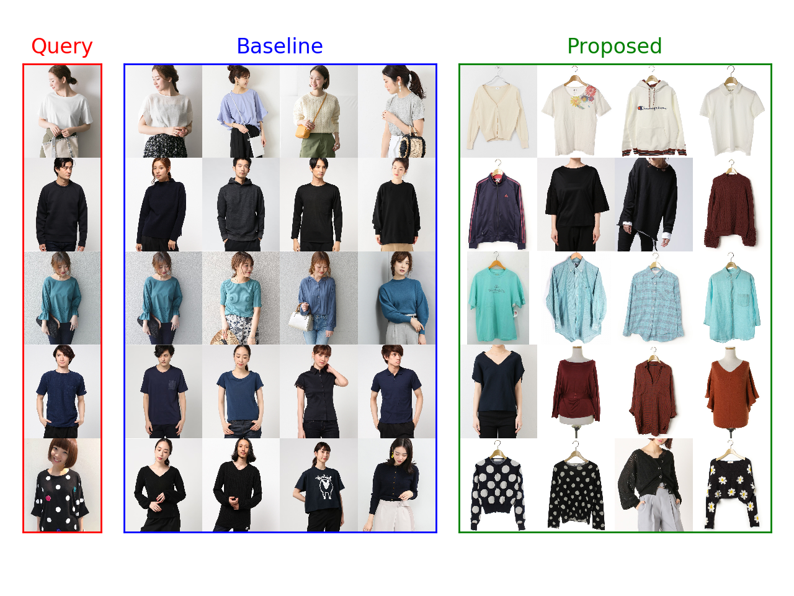

## ZOZO transformaer

## Motivation

Mercari proposed an interesting method to enhance image-based item search.

https://sigir-ecom.github.io/ecom19Papers/paper3.pdf

## Dataset

Sample images are collected from [ZOZOTOWN](https://zozo.jp/).

## Feature Extractor

ResNet50 trained on Imagenet (The paper says the authors used MobileNetV2.)

## Result

